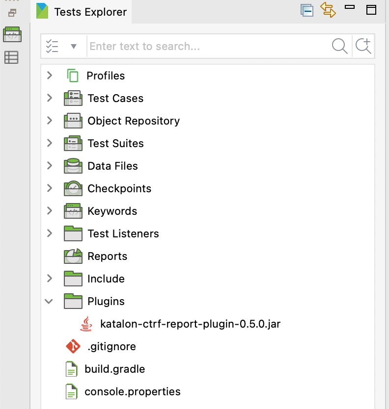
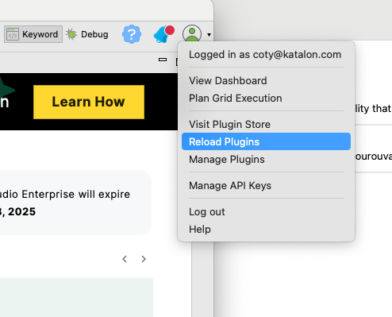
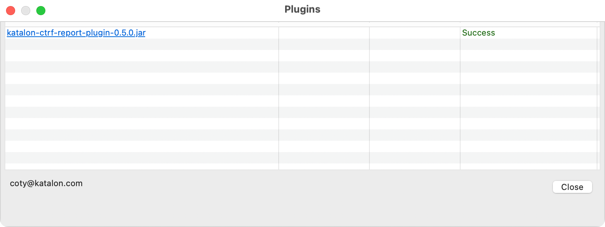
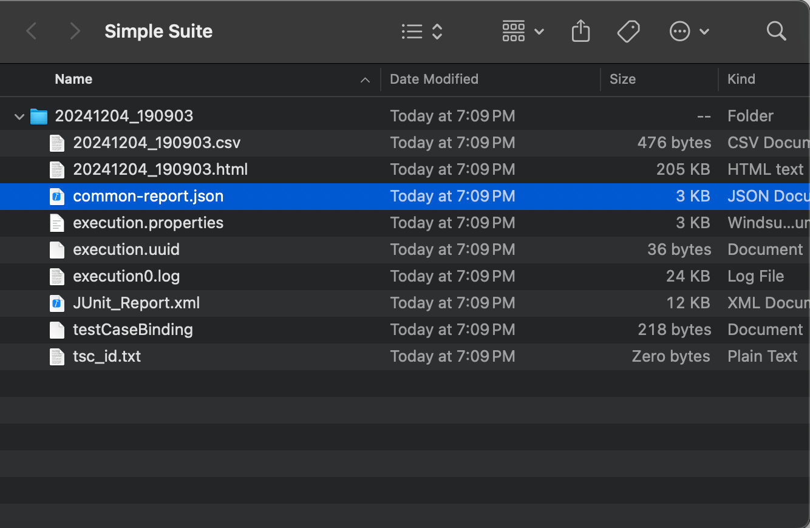

# Katalon Studio CTRF Report Plugin
Katalon Studio plugin to enable generation of [CTRF](https://ctrf.io) formatted reports.

**Installation Options**
---

1. Download the plugin jar file from the [latest release](https://github.com/katalon-studio/katalon-studio-ctrf-report-plugin/releases) and place it in the Plugins directory of your Katalon Studio installation:

2. Reload the plugins in Katalon Studio by selecting `Plugin > Reload Plugins` from the main menu:

3. You should see the plugin listed in the resulting dialog:

**Usage**
---

1. Install the plugin as described above.
2. Run a test suite and find the resulting report in the Reports directory of your project:

**Limitations**
---

1. This is the initial release of the plugin and is not yet fully featured. Please open an issue if you have any feature requests or bug reports.